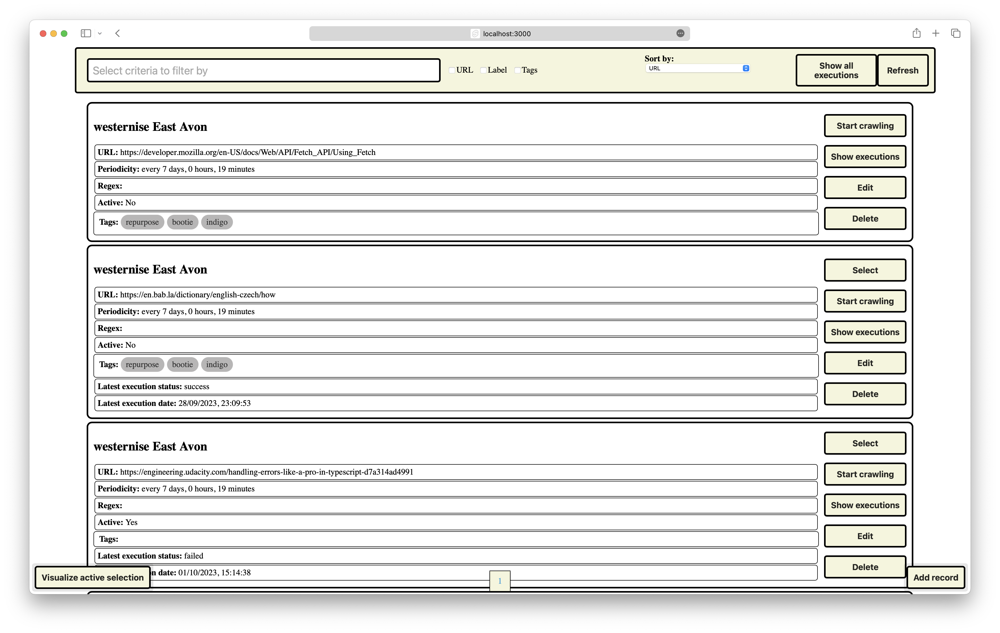
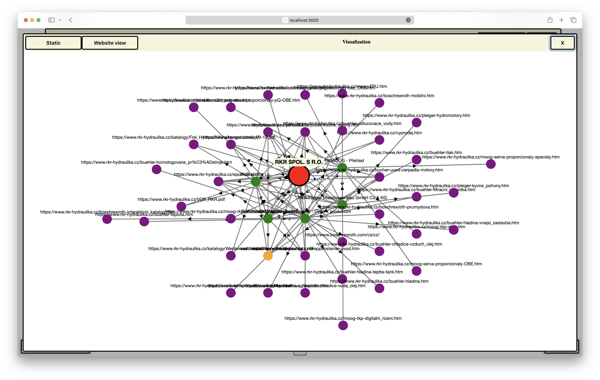

# MFF-Web-TeamProject

`TypeScript` `Svelte` `Svelte-kit` `Node.js` `express.js` `axios` `cherio` `Docker` `cytoscape` `graphql` `MongoDB` `vite`

This is a web crawler for the Advanced Web Programming course at MFF UK. 
The goal of this project is to create a [Web Crawler](https://cs.wikipedia.org/wiki/Web_crawler). <br> You can find more details about this project in the [Specefication](./Specification.md).




### Main parts of the application

- **crawler**: Node.js - express.js with threading support (crawler workers)
- **web-app**: Svelte-kit
- **database**: MongoDB

## Getting started

```bash
$ git clone git@github.com:MarkSeliverstov/MFF-WebTeamProject.git
$ cd MFF-WebTeamProject
$ docker-compose up 
```

### Development

Should be working properly. Hot reload setup of `web-app` as well. 

For development run:
```shell
docker compose up -d
```
**Running web-app at: localhost:3000, crawler at: localhost:5000 and mongo-express at localhost:8080.**

In case a new package is added rebuild is needed:
```shell
docker compose build
```
It is probably a good idea to run this command after pulling from GitHub

If you stop developing for the day run:
For development run:
```shell
docker compose down
```
So you are not losing your computer resources :)


